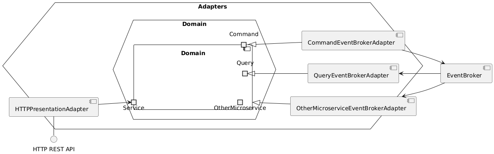

# Assignment #03 - Software Architecture and Platforms - a.y. 2024-2025

v0.9.0-20241209

<!-- toc -->

- [Usage](#usage)
- [Requirements](#requirements)
  * [User Stories](#user-stories)
  * [Use cases](#use-cases)
    + [Scenarios](#scenarios)
  * [Business requirements](#business-requirements)
- [Analisys](#analisys)
  * [Bounded contexts](#bounded-contexts)
  * [Ubiquitous language](#ubiquitous-language)
- [Design](#design)
  * [EBikes and Users microservices](#ebikes-and-users-microservices)
  * [Rides microservice](#rides-microservice)
- [Deployment](#deployment)
- [Fault tolerance / recovering](#fault-tolerance--recovering)
- [Service discovery](#service-discovery)
- [Configuration](#configuration)

<!-- tocstop -->

**Description** 

- Develop a solution of the "EBike application" based on an event-driven microservices architecture, applying the Event Sourcing pattern where considered useful.

- Define a deployment of the application on a distributed infrastructure (e.g. a cluster) based on Kubernetes, exploiting the features provided by the framework.

- Consider an extension of the EBike case study, featuring a new kind of experimental e-bike, i.e. autonomous e-bike ("a-bike") for smart city environment. Main features of the a-bikes:
  - can autonomously reach the nearest station, after being used;
  - can autonomously reach a user, asking for the service.
  
  The a-bikes are meant to be deployed into a smart city featuring a digital twin which provides basic functionalities to support a-bike autonomous mobility. Propose a solution, discussing the design and including a demo implementation of a core part, capturing main aspects.  

    
**Deliverable**

A GitHub repo including sources and documentation. The link to the repo must be included in a file ``Assignment-03-<Surname>`` and submitted using a link on the course web site.

**Deadline** 

No deadlines.
 

## Usage
Running from the build tool (automatically assembles the jars):
```sh
sbt composeUpDev
```

Otherwise with the jars already built:
```sh
docker compose -f ./docker-compose.yml -f ./docker-compose.dev.yml --env-file ./development.env build
docker compose -f ./docker-compose.yml -f ./docker-compose.dev.yml  --env-file ./development.env up --force-recreate
```

Otherwise you can pull the images from dockerhub:
```sh
docker compose -f ./docker-compose.yml -f ./docker-compose.dev.yml -f ./docker-compose.hub.yml --env-file ./development.env up --force-recreate
```
 
## Requirements

### User Stories

|As a|I want|so that|
|----|----------|-------------|
|user|to go on a ride with a rented bike|I can leave it wherever i want|
|business stakeholder|the bikes to autonomously go to the user when requested|provide a fantastic service to my customers|
|business stakeholder|the bikes to autonomously go back to the charging station|save money with respect to paying someone to do that|
|system administrator|to see the current location of every bike|I can check if was left too far|
|system administrator|to see which users are currently riding a bike|I can spot any anomaly if present|
|system administrator|to see all the registered users|I can spot any anomaly if present|
|system administrator|to add new bikes to the system|I can increase the number of bikes in the future|

### Business requirements
Autonomous bikes must follow the traffic laws (stopping at red traffic lights)

### Use cases


#### Scenarios

- Go on a ride:
    1. The user chooses an available bike and selects "Request bike"
    1. The bike detaches from the charging station and rides up to the user
    1. As soon as the bike reaches the user the ride actually start
    1. The user selects "End ride"
    1. The bike autonomously rides back to the charging station

- Add new bike:
    1. The system administrator chooses an id for the new bike and confirms
    1. The system checks that the id is valid, and if it's not it fails the operation
    1. The system register the new bike with the given valid id

- See registered users:
    1. The system administrator interface shows always every registered user

- Monitor rides
    1. The system administrator interface shows user usernames that are on a ride alongside the bike their riding

- Monitor bike positons
    1. The system administrator interface shows a graphical representation of the bike locations on a 2D space

## Analisys

### Bounded contexts
Given the requirements multiple bounded contexts were identified:

- System administrator interactions
- User interactions
- Users management
- E-bikes management
- Rides management
- Smart city

### Ubiquitous language

|Word|Definition|Synonyms|
|----|----------|--------|
|User|The actual app customer one which rents bikes to ride|Customer|
|Username|A text chosen by the user which uniquely identifies him inside the system|User id|
|Admin|An employee of the organization whose responsibility is to monitor the system and to take actions to let the system work as expected|System administrator|
|E-bike|An electric bike which can be rented by the users|Ebike, bike|
|E-bike location|The geographical location of the bike|E-bike position|
|Charging station|A phisical place in the city where ebikes can charge their batteries||
|Traffic light|An indicator on a street junction that indicates whether the traffic should stop or proceed|Semaphore|
|Traffic light state|A traffic light can be Red (stop) or Green (pass)|Light|
|Junction|A place where multiple streets meet||
|Street|A rideable road segment between two street junctions|Road|
|Smart city|The set of items allowing autonomous mobility in the city (charging stations, traffic lights, streets and junctions)||
|Ride|The rental of a bike from a user which aims to use it to move from one place to another||
|Register new ebike|An action taken by the admin which has the outcome of making the system aware of a new bike which can then be rented|Create new ebike|
|Monitor ebikes/rides|Admin's capability to check the location of each bike and which users are riding them||

## Design

The system is designed follwing an event-driven microservices architecture where each bounded contexts is mapped to a single microservice or frontend.

Every microservice will expose an HTTP REST API for client consumption while internally to the system communication will rely on an event broker.


In general every microservice will have the following architecture:



- A command side will be used to publish commands (or command-events) to the event store.
- A query side will consume published commands to use them for event-sourcing and if applicable materialise the state to achieve more efficient queries.
- Any data needed from other microservices will be consumed off the event store and materialised as described in the query side.

## Possible replication
For simplicity both the command and the query sides will be running inside the same process but if split they could be replicated independently.

The command side is stateless since it doesn't need to have any knowledge about the current state of the system (as explained [here](#handling-http-requests))

The query side is stateless while considering only event-sourcing and stateful if it materialises the state, but it could be replicated even in this case as when initialised it will consume all the events from the beginning actually restoring the materialised view.

> **Note:**
>
> Keeping reads consistent would require that requests from a client are always directed to the same query side instance

## Handling HTTP Requests

"Read" requests are trivial to handle, they just ask the query model and give the answer as a response.

"Write" requests are more difficult to handle, especially because the command side doesn't have any knowledge about the current state of the system and this means it cannot undestand if a request is valid or not (for example updating the state of a bike if it doesn't exist).

So every "write" request will be handled as explained in this example:
1. The client sends a POST request to register a new bike
1. The command side publishes the relative command and return a response where success means that the command has been recorded (but it may not be applicable). The response includes a unique identifier for the command that was issued
1. The client can now poll the server for the given identifier until it gets a response
1. The response will contain the actual result of applying the command.

Obviously when applying event-sourcing commands that are not valid for the current state of the domain entity will just be ignored.

This is a bit of a burden for the client but it guarantees read-after-write consistency keeping the command side stateless.

## Deployment
<!-- TODO: update! Kubernetes? -->
Each microservice will be deployed as a standalone Docker container while the two frontends will be deployed as standard GUI apps.

In order to achieve an effective and simple deployment a [docker compose file](./docker-compose.yml) has been written.

## Fault tolerance / recovering
<!-- TODO: update! Kubernetes? -->
The system will exploit the underlying deployment platform (Docker / Docker compose) to restart services in case of failure.

## Service discovery
<!-- TODO: update! Kubernetes? -->
A service discovery mechanism has to be implemented due to the subsequent reasons:
- Each microservice could be restarted in case of failure and as a consequence it could change it's network address
- Future versions of the software may require to create multiple instances of the same service due to heavy workloads and therefore the network address may change at runtime.

Given these requirements the built-in DNS service provided by Docker can be exploited to achieve the desired behavior.

## Configuration
Since the microservices configuration does not need to be changed at runtime the simplest way to provide an externalized configuration is through enviornment variables that will be passed at deploy-time.
