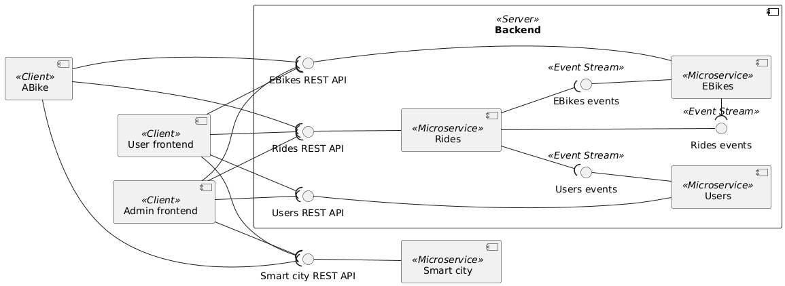
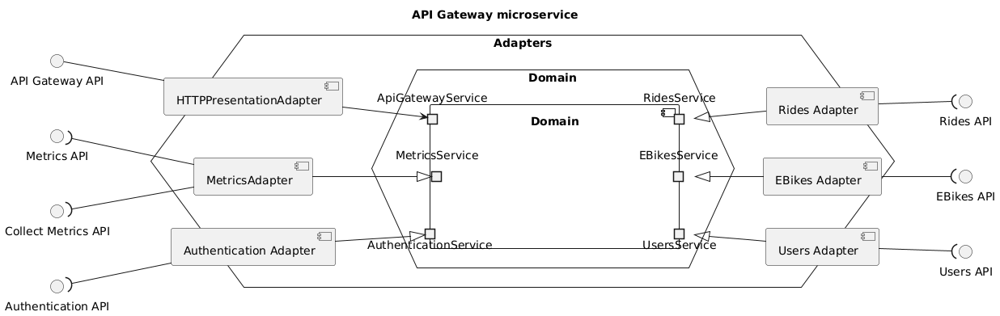
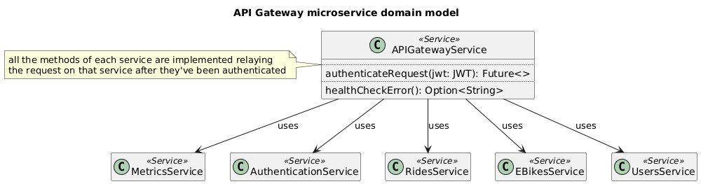
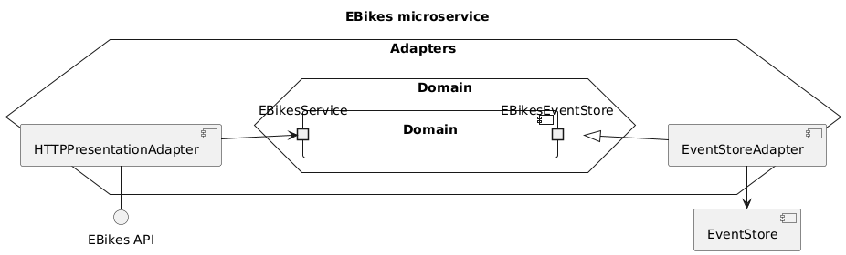
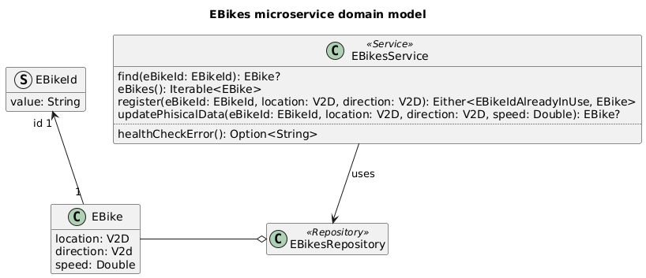
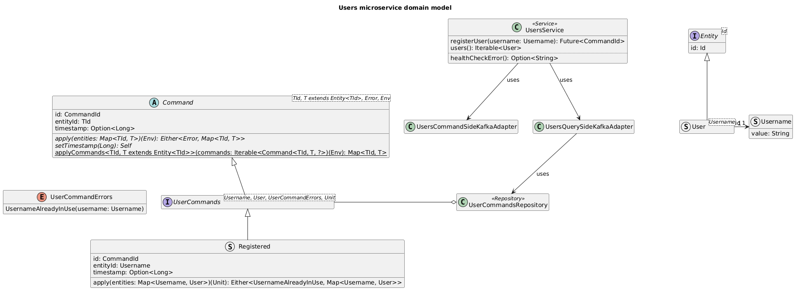
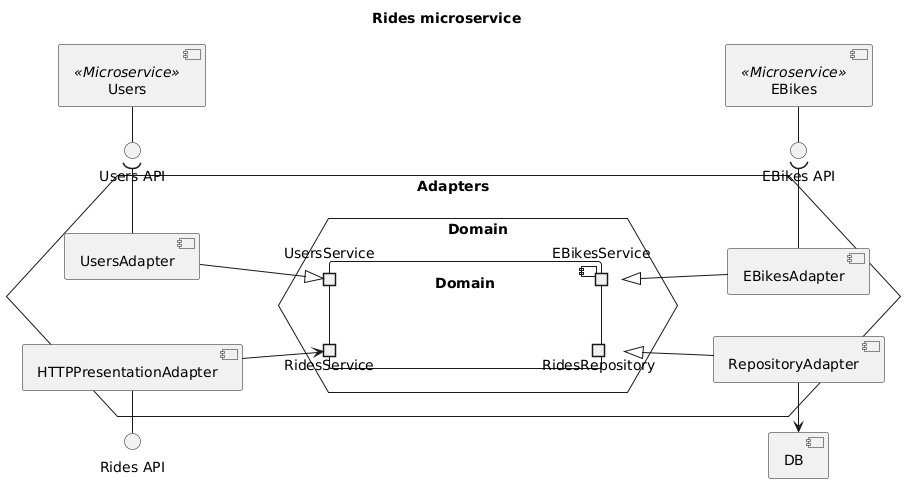
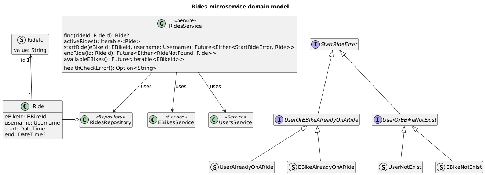
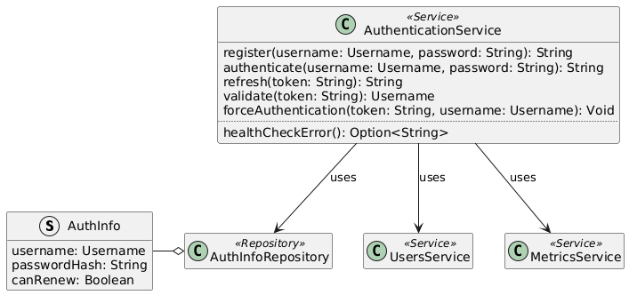
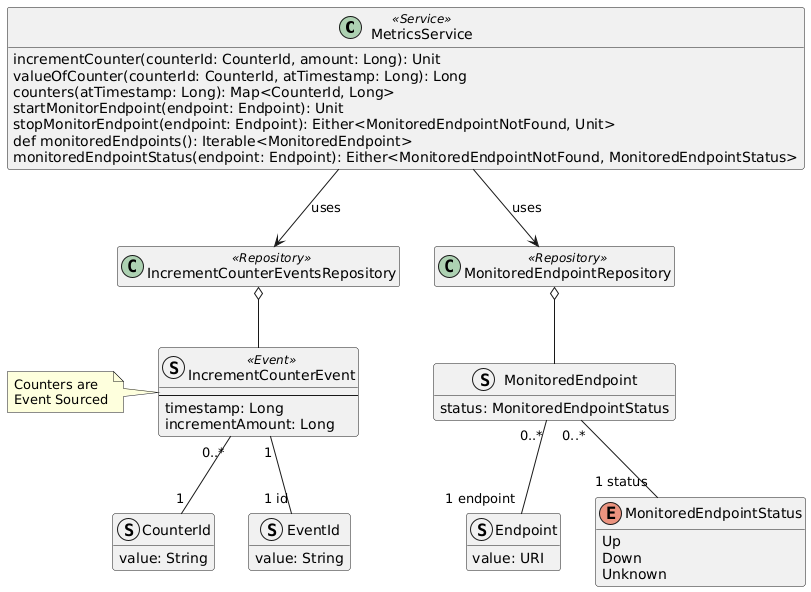

# Assignment #02 - Software Architecture and Platforms - a.y. 2024-2025

- [Description](#description)
- [Usage](#usage)
- [Requirements](#requirements)
  * [User Stories](#user-stories)
  * [Use cases](#use-cases)
    + [Scenarios](#scenarios)
  * [Business requirements](#business-requirements)
  * [Quality attribute scenarios](#quality-attribute-scenarios)
- [Analisys](#analisys)
  * [Bounded contexts](#bounded-contexts)
  * [Ubiquitous language](#ubiquitous-language)
- [Design](#design)
  * [API Gateway](#api-gateway)
    + [A choice regarding security](#a-choice-regarding-security)
  * [EBikes and Users microservices](#ebikes-and-users-microservices)
  * [Rides microservice](#rides-microservice)
  * [Authentication microservice](#authentication-microservice)
    + [Bounded context language](#bounded-context-language)
    + [Register new user](#register-new-user)
    + [Authenticate existing user](#authenticate-existing-user)
    + [Validating a JTW token](#validating-a-jtw-token)
    + [Refreshing JWT token](#refreshing-jwt-token)
    + [Force authentication](#force-authentication)
  * [Metrics microservice](#metrics-microservice)
- [Deployment](#deployment)
- [Fault tolerance / recovering](#fault-tolerance--recovering)
- [Service discovery](#service-discovery)
- [Configuration](#configuration)
- [Testing](#testing)
- [Issues](#issues)
  * [Incompleteness](#incompleteness)

## Description

Consider the "EBike application" seen in the first assignment. The objective of the second assignment is to design and develop a distributed version based on microservices and microservices patterns - as discussed in modules 2.X and in Lab Notes about microservices patterns, and adopting DDD as reference method for the analysis and development stage.

In particular:

- A knowledge crunching process must be enacted so to gather and represent architectural drivers, defining (following DDD) a proper Ubiquitous Language, structured around a domain model, and using it to define artifacts useful to both define requirements and quality attributes (user stories, use cases, domain stories, quality attribute scenarios), as well as bounded contexts and context map.
- Moving from strategical to tactical design, a model-driven design should be adopted, applying -- when useful -- DDD domain model pattern.
- The architecture should be based on microservices and hexagonal/ports & adapters/clean architecture style, for the design of the individual service.
- The architecture should integrate microservices patterns that are considered relevant, given the case study, considering the different examples and categories seen in the course:
  - Application-level patterns 
  - Testing patterns
  - Deployment patterns
  - Runtime Configuration pattern
  - Observabilty Patterns
- A strategy for validating the proposed architecture should be devised and enacted, given the requirements and the quality attributes defined in the analysis stage.  
    
**Deliverable**

A zipped folder ``Assignment-02-<Surname>`` including a maven-based or gradle-based project, with sources and the report in PDF. The deliverable can be submitted using a link on the course web site.

**Deadline** 

November 29, 2024 - 9:00 AM

## Usage
Running from the build tool (automatically assembles the jars):
```sh
sbt composeUpDev
```

Otherwise with the jars already built:
```sh
docker compose -f ./docker-compose.yml -f ./docker-compose.dev.yml --env-file ./development.env build
docker compose -f ./docker-compose.yml -f ./docker-compose.dev.yml  --env-file ./development.env up --force-recreate
```

Otherwise you can pull the images from dockerhub:
```sh
docker compose -f ./docker-compose.yml -f ./docker-compose.dev.yml -f ./docker-compose.hub.yml --env-file ./development.env up --force-recreate
```
 
## Requirements

### User Stories

|As a| I want to|so that I can|
|----|----------|-------------|
|user|go on a ride with a rented bike|leave it wherever i want|
|user|check my credit|understand if it needs to be recharged|
|user|recharge my credit|go on a ride|
|system administrator|see the current location of every bike|check if was left too far|
|system administrator|see which users are currently riding a bike|spot any anomaly if present|
|system administrator|see all the registered users and their credit|spot any anomaly if present|
|system administrator|add new bikes to the system|increase the number of bikes in the future|
|system administrator|be able to monitor metrics of the system (like health status of each component or the amount of request that were served)|spot any anomaly if present|

### Use cases


#### Scenarios

- Go on a ride:
    1. The user chooses an available bike and selects "Start ride"
    1. The user can see his credits updating while he's riding
    1. The user selects "End ride"

- Check credit:
    1. The user sees his credit right in the home screen

- Recharge credit:
    1. The user selects a "recharge credit" button
    1. The user inserts how much credits he wants to deposit
    1. The user confirms

- Add new bike:
    1. The system administrator chooses an id for the new bike and confirms
    1. The system checks that the id is valid, and if it's not it fails the operation
    1. The system register the new bike with the given valid id

- See registered users and their credit:
    1. The system administrator interface shows always every registered user alongside his credit

- Monitor rides
    1. The system administrator interface shows user usernames that are on a ride alongside the bike their riding

- Monitor bike positons
    1. The system administrator interface shows a graphical representation of the bike locations on a 2D space

- Monitor system metrics
    1. The system administrator interface shows for every component if it's running or not and the total amount of served requests

### Business requirements
- The credit of the user must be decreased by 1 unit every second

### Quality attribute scenarios

|Quality attribute|Source|Stimulus|Artifact|Environment|Response|Response measure|
|------------|------------|------------|------------|------------|------------|------------|
|Availablilty|User/Admin|Interacts with the system causing a component crash|System component|Normal conditions|The component is restarted|in 10 seconds|
Observability|User/Admin|Sends a request|System|Normal conditions|Keeps a request counter|An updated requests counter is somehow exposed|
Observability|User/Admin|Interacts with the system causing a component crash|System component|Normal conditions|Tracks the current state of the crashed component|Updated information about the component state are somehow exposed|

## Analisys

### Bounded contexts
Given the requirements multiple bounded contexts were identified:

- System administrator interactions
- User interactions
- Users management
- E-bikes management
- Rides management
- User authentication (emerged due to the need of storing users credit)
- Metrics monitoring

### Ubiquitous language

|Word|Definition|Synonyms|
|----|----------|--------|
|User|The actual app customer one which rents bikes to ride|Customer|
|Username|A text chosen by the user which uniquely identifies him inside the system|User id|
|Admin|An employee of the organization whose responsibility is to monitor the system and to take actions to let the system work as expected|System administrator|
|E-bike|An electric bike which can be rented by the users|Ebike, bike|
|E-bike location|The geographical location of the bike|E-bike position|
|Ride|The rental of a bike from a user which aims to use it to move from one place to another||
|Credit|An internal currency that the users exchange with bikes rental time||
|Recharge credit|Process executed by the user by which his credit is increased by the requested amount||
|Register new ebike|An action taken by the admin which has the outcome of making the system aware of a new bike which can then be rented|Create new ebike|
|Monitor ebikes/rides|Admin's capability to check the location of each bike and which users are riding them||
|Authentication|Process by which the user provides enough data to the system to identify him|Login|
|Metric|A measurement relative to a specific characteristic|Measurement|

## Design

The system is designed follwing a microservice architecture where each bounded contexts is mapped to a single microservice or frontend.



\* The metrics service actually runs an healthcheck on every microservice and therefore it is loosely dependant on them, these dependencies are not shown in the diagram for the sake of simplicity

### API Gateway
The API Gateway microservice is the only service exposed to the internet.

It has the responsibility to relay the client requests to the appropriate services.




#### A choice regarding security
Given the fact that the API Gateway is the only exposed access point it will be resposible for validating (through the Authentication microservice) every request before relaying it.

This allows to keep the token validation logic centralized letting every other microservice assume that the requests they receive are authenticated.

This is by far not a much secure solution but for the purpose of this project it allows to reduce overall complexity.

### EBikes and Users microservices

The EBikes microservice and the Users microservice are both built follwing the hexagonal architecture.

They don't depend on any other microservice (except the Metrics microservice but they can work perfectly even it that's down).







### Rides microservice

The Rides microservice is built follwing the hexagonal architecture.

It depends on both the other microservices (EBikes and Users).




### Authentication microservice

The Authentication service is responsible for every aspect regarding user authentication.

In fact the user password is not stored in the [user microservice](#ebikes-and-users-microservices) but it's stored in this one.



#### Bounded context language
|Word|Definition|Synonyms|
|----|----------|--------|
|Password|The user's secret string that lets him authenticate himself||
|PasswordHash|An hashed password, it allows to not store passwords in clear text format||
|JWT|A token signed by the system that authenticates a user|JSON Web Token|
|AuthInfo|A data structure that holds the user's passwordHash and a flag regarding automatic token renewal||

Operations offered by this service are handled in this way:

#### Register new user
Registering a new user is the most complex operation as it requires interaction with the Users microservice.

The service:
1. will check that a user with that username does not already exist.
1. will send a request of registering a user to the Users service
1. if the operation succedes then will proceed by inserting a new AuthInfo into its AuthInfoRepository.
1. will issue and return a JWT token

In case of failure of the operation after successfully completing point 2 the system may be in an unconsistent state (a user has been created but has no AuthInfo).

To achieve eventual consistency this edge case is handled as it follows:
1. Once the service will try to create the (same) user (point 2) it will receive an error saying that the user is already registered but since it was already checked that no AuthInfo existed then the service will proceed like no error has happened.

#### Authenticate existing user
Given a username and password the service checks if they're valid and if so it issues a JWT with relatively short expiration time (like 15 minutes).
Also ensures that the `canRenew` flag is set to true.

#### Validating a JTW token
Given a JWT token the service verify it has a valid signature and that it's not expired.

#### Refreshing JWT token
Given a non-expired token the service will issue a new one only if the `canRenew` flag of the relative AuthInfo is set to true.

#### Force authentication
The `canRenew` flag of the user with the given username will be set to false so that it cannot renew his tokens until he authenticates again.

> **Note:**
>
> This mechanism allow to easily renew tokens while still keeping the possibility of forcing a user to re-authenticate. (For example in case he changes his password or strange behaviors are detected)

### Metrics microservice

The metrics service is responsible for storing metrics data of the whole system.



The required metrics are:
- health status of each microservice
- total amount of requests served by each microservice

The health status will be tracked by polling each service at a fixed interval (Pull strategy)

The amount of requests will be reported by every microservice to the Metrics service (Push strategy)

## Deployment
Each microservice will be deployed as a standalone Docker container while the two frontends will be deployed as standard GUI apps.

In order to achieve an effective and simple deployment a [docker compose file](./docker-compose.yml) has been written.

## Fault tolerance / recovering
The system will exploit the underlying deployment platform (Docker / Docker compose) to restart services in case of failure.

## Service discovery
A service discovery mechanism has to be implemented due to the subsequent reasons:
- Each microservice could be restarted in case of failure and as a consequence it could change it's network address
- Future versions of the software may require to create multiple instances of the same service due to heavy workloads and therefore the network address may change at runtime.

Given these requirements the built-in DNS service provided by Docker can be exploited to achieve the desired behavior.

## Configuration
Since the microservices configuration does not need to be changed at runtime the simplest way to provide an externalized configuration is through enviornment variables that will be passed at deploy-time.

## Testing
It is required to provide at least one test for each layer in the testing pyramid

<!-- TODO: add example tests references -->
|Test type  |Amount     |Complexity |Examples   |
|-----------|-----------|-----------|-----------|
|End-to-end |Low        |Very high  |End to end [tests](./postman-tests.json) were made manually through Postman|
|Component  |Medium     |High       |[EBikesComponentTests](./EBikes/src/test/scala/ebikes/EBikesComponentTests.scala)|
|Integration|High       |Medium     |[EBikesFileSystemRepositoryAdapterTests](./EBikes/src/test/scala/ebikes/adapters/persistence/EBikesFileSystemRepositoryAdapterTests.scala), [HttpPresentationAdapterTests](./EBikes/src/test/scala/ebikes/adapters/presentation/HttpPresentationAdapterTests.scala)|
|Unit       |Very high  |Low        |[EBikesServiceTests](./EBikes/src/test/scala/ebikes/domain/EBikesServiceTests.scala), [V2DTests](./EBikes/src/test/scala/ebikes/domain/model/V2DTests.scala)|

## Issues

### Incompleteness
Due to time constraints the system lacks these features:
- Differentiation between users and admins
- Proper authorization checks
- Incomplete API gateway (it only relays to EBikes and Authentication microservices)
- The user credit is not decreased when riding
- The GUI is really ugly
- The admin interface is missing the ability to register a new bike
  
  In order to register a bike to test the system you can run
  ```sh
  curl --location 'localhost:8081/ebikes' \
  --header 'Content-Type: application/json' \
  --data '{
      "id": {
          "value": "bike1"
      },
      "location": {
          "x": 0,
          "y": 0
      },
      "direction": {
          "x": 0,
          "y": 0
      }
  }'
  ```
