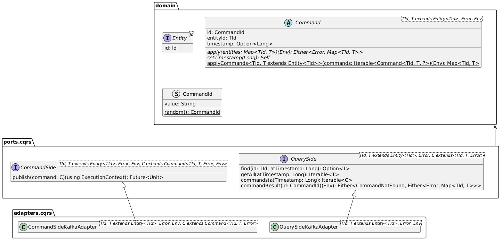

# Assignment #03 - Software Architecture and Platforms - a.y. 2024-2025

<!-- toc -->

- [Usage](#usage)
  - [Build the images locally (Optional)](#build-the-images-locally-optional)
  - [Run](#run)
  - [Stop](#stop)
  - [GUI](#gui)
- [Requirements](#requirements)
  - [User Stories](#user-stories)
  - [Business requirements](#business-requirements)
  - [Use cases](#use-cases)
    - [Scenarios](#scenarios)
- [Analisys](#analisys)
  - [Bounded contexts](#bounded-contexts)
  - [Ubiquitous language](#ubiquitous-language)
- [Domain design](#domain-design)
  - [Smart city microservice](#smart-city-microservice)
  - [Autonomous bikes behavior](#autonomous-bikes-behavior)
- [Architecture design](#architecture-design)
  - [CQRS and event sourcing](#cqrs-and-event-sourcing)
    - [Event sourcing](#event-sourcing)
    - [CQRS](#cqrs)
    - [Example of usage (Users microservice)](#example-of-usage-users-microservice)
    - [Warning](#warning)
  - [Possible replication](#possible-replication)
  - [Handling HTTP Requests](#handling-http-requests)
- [Deployment](#deployment)
  - [Development](#development)
  - [Production](#production)
    - [Kafka](#kafka)
    - [EBikes/Users/Rides microservices](#ebikesusersrides-microservices)
    - [Smart city microservice](#smart-city-microservice-1)
    - [ABikes simulator](#abikes-simulator)
- [Fault tolerance / recovering](#fault-tolerance--recovering)
- [Service discovery](#service-discovery)
- [Configuration](#configuration)
- [Regarding CAP theorem](#regarding-cap-theorem)
  - [Partition tolerance](#partition-tolerance)
    - [When a service instance can't reach the event broker](#when-a-service-instance-cant-reach-the-event-broker)
    - [When a service instance can't be reached by Kubernetes' load balancer](#when-a-service-instance-cant-be-reached-by-kubernetes-load-balancer)
  - [Availability](#availability)
  - [Consistency](#consistency)
    - [Ordering of events](#ordering-of-events)
- [Scalability](#scalability)
- [Fault tolerance](#fault-tolerance)
- [Service replication](#service-replication)

<!-- tocstop -->

**Description**

v0.9.0-20241209

- Develop a solution of the "EBike application" based on an event-driven microservices architecture, applying the Event Sourcing pattern where considered useful.

- Define a deployment of the application on a distributed infrastructure (e.g. a cluster) based on Kubernetes, exploiting the features provided by the framework.

- Consider an extension of the EBike case study, featuring a new kind of experimental e-bike, i.e. autonomous e-bike ("a-bike") for smart city environment. Main features of the a-bikes:

  - can autonomously reach the nearest station, after being used;
  - can autonomously reach a user, asking for the service.

  The a-bikes are meant to be deployed into a smart city featuring a digital twin which provides basic functionalities to support a-bike autonomous mobility. Propose a solution, discussing the design and including a demo implementation of a core part, capturing main aspects.

**Deliverable**

A GitHub repo including sources and documentation. The link to the repo must be included in a file `Assignment-03-<Surname>` and submitted using a link on the course web site.

**Deadline**

No deadlines.

## Usage

It's possible to both locally build the docker images or use the ones uploaded on DockerHub.

### Build the images locally (Optional)

```sh
# You can either run
sbt composeBuildDev
# or
docker compose -f ./docker-compose.yml -f ./docker-compose.dev.yml --env-file ./development.env build
```

### Run

You can either run the system under Docker compose:

```sh
# You can either run
sbt composeUpDev
# or
docker compose -f ./docker-compose.yml -f ./docker-compose.dev.yml  --env-file ./development.env up --force-recreate
```

or Kubernetes:

```sh
kubectl apply -f kubernetes
```

> **Note:**
>
> If you use minikube kubernetes will not automatically see the docker images you've built locally, but that should not be a problem as it should fall back to downloading them from DockerHub.
>
> If you are using the kubernetes environment integrated with Docker Desktop you should not encounter this problem.

### Stop

If you run on docker compose it should be enough to press ctrl+C on the terminal (or run `docker compose down`)

If you run on kubernetes just run:

```sh
kubectl delete -f kubernetes
```

### GUI

A simple GUI has been developed just for testing purposes.

In the top part of the GUI a graph diagram shows the streets graph.

1. Run `./GUI/setup.sh` to setup the GUI
1. Open the `GUI/index.html` file in your browser
1. Register a new user by clicking on the appropriate button
1. Register a new bike by clicking on the appropriate button
1. To simulate a user requesting a new bike:
   1. Click on "Start ride"
   1. Insert the requesting user username
   1. Insert the junction in which the user is located
   1. Insert the bike identifier
1. The bottom part of the GUI will show every ride and a button to simulate the user's intent to stop riding

## Requirements

### User Stories

| As a                 | I want                                                    | so that                                              |
| -------------------- | --------------------------------------------------------- | ---------------------------------------------------- |
| user                 | to go on a ride with a rented bike                        | I can leave it wherever i want                       |
| business stakeholder | the bikes to autonomously go to the user when requested   | provide a fantastic service to my customers          |
| business stakeholder | the bikes to autonomously go back to the charging station | save money with respect to paying someone to do that |
| system administrator | to see the current location of every bike                 | I can check if was left too far                      |
| system administrator | to see which users are currently riding a bike            | I can spot any anomaly if present                    |
| system administrator | to see all the registered users                           | I can spot any anomaly if present                    |
| system administrator | to add new bikes to the system                            | I can increase the number of bikes in the future     |

### Business requirements

Autonomous bikes must follow the traffic laws (stopping at red traffic lights)

### Use cases


#### Scenarios

- Go on a ride:

  1. The user chooses an available bike and selects "Request bike"
  1. The bike detaches from the charging station and rides up to the user
  1. As soon as the bike reaches the user the ride actually start
  1. The user selects "End ride"
  1. The bike autonomously rides back to the charging station

- Add new bike:

  1. The system administrator chooses an id for the new bike and confirms
  1. The system checks that the id is valid, and if it's not it fails the operation
  1. The system register the new bike with the given valid id

- See registered users:

  1. The system administrator interface shows always every registered user

- Monitor rides

  1. The system administrator interface shows user usernames that are on a ride alongside the bike their riding

- Monitor bike positons
  1. The system administrator interface shows a graphical representation of the bike locations on a 2D space

## Analisys

### Bounded contexts

Given the requirements multiple bounded contexts were identified:

- System administrator interactions
- User interactions
- Users management
- E-bikes management
- Rides management
- Smart city

### Ubiquitous language

| Word                 | Definition                                                                                                                           | Synonyms             |
| -------------------- | ------------------------------------------------------------------------------------------------------------------------------------ | -------------------- |
| User                 | The actual app customer one which rents bikes to ride                                                                                | Customer             |
| Username             | A text chosen by the user which uniquely identifies him inside the system                                                            | User id              |
| Admin                | An employee of the organization whose responsibility is to monitor the system and to take actions to let the system work as expected | System administrator |
| E-bike               | An electric bike which can be rented by the users                                                                                    | Ebike, bike          |
| E-bike location      | The geographical location of the bike                                                                                                | E-bike position      |
| Charging station     | A phisical place in the city where ebikes can charge their batteries                                                                 |                      |
| Traffic light        | An indicator on a street junction that indicates whether the traffic should stop or proceed                                          | Semaphore            |
| Traffic light state  | A traffic light can be Red (stop) or Green (pass)                                                                                    | Light                |
| Junction             | A place where multiple streets meet                                                                                                  |                      |
| Street               | A rideable road segment between two street junctions                                                                                 | Road                 |
| Smart city           | The set of items allowing autonomous mobility in the city (charging stations, traffic lights, streets and junctions)                 |                      |
| Ride                 | The rental of a bike from a user which aims to use it to move from one place to another                                              |                      |
| Register new ebike   | An action taken by the admin which has the outcome of making the system aware of a new bike which can then be rented                 | Create new ebike     |
| Monitor ebikes/rides | Admin's capability to check the location of each bike and which users are riding them                                                |                      |

## Domain design

In this section are explained only non trivial domain design choices.

### Smart city microservice


For the sake of time and simplicity the following assumptions are made:

- There's only one charging station
- Semaphores block traffic in any direction
- There can be at most one semaphore in a junction
- Every street is bidirectional
- The streets graph is fixed

### Autonomous bikes behavior

An [ABikeSimulator](./ABikesSimulator/src/main/scala/abikessimulator/ABikesSimulator.scala) simulates the autonomous behavior of the bikes.

It works this way:

1. Polls the rides service to get active rides.
1. For each active ride, based on it's status it simulates the bike behavior
   - status `BikeGoingToUser`:
     1. The bike asks the smart city service what's the best path to reach the user
     1. The bike follows the path while asking to the smart city service about eventual semaphores statuses
     1. When the bike reaches the user it informs the rides service that the user was reached
   - status `UserRiding`:
     1. The bike randomly jumps from one node to another (simulating a user ride)
   - status `BikeGoingBackToStation`:
     1. The bike asks the smart city service what's the best path to reach the charging station
     1. The bike follows the path while asking to the smart city service about eventual semaphores statuses
     1. When the bike reaches the station it informs the rides service that the station was reached

## Architecture design

The system is designed follwing an event-driven microservices architecture where each bounded contexts is mapped to a single microservice or frontend.

Every microservice will expose an HTTP REST API for client consumption while internally to the system communication will rely on event streams.

> **Note:**
>
> For the scope of this project just a demonstration GUI was realized instead of the two frontends.


### CQRS and event sourcing

In general every microservice will have the following architecture:


- A command side will be used to publish commands (or command-events) to the event broker.
- A query side will consume published commands to use them for event-sourcing and if applicable materialise the state to achieve more efficient queries.
- Any data needed from other microservices will be consumed off the event broker and materialised as described in the query side.


This is a generic implementation of the CQRS and ES patterns.

#### Event sourcing

Basically every entity that wants to be event sourced should implement the Entity interface that just requires to expose an entity identifier.

All the commands that can be applied to an entity must implement the Command interface which requires:

- an _id_ which uniquely identifies the command
- an _entityId_ which uniquely identifies the entity
- an optional timestamp which must be set to the time the command was persisted
- and should provide an _apply_ method which applies the command to an collection of entities and returns an updated collection or an error.
- subclasses of Command should also provide an Environment which is a datatype that can hold any necessary data to perform the application of a command. (For example when applying a command which should create a ride it should also be able to access data about ebikes and users).

The Command interface is actually an abstract class which provides a static method that applies in sequence all the commands in a collection which do not result in errors.
It is expected that every command refers to the same entity.

#### CQRS

Two interface are provided:

- _CommandSide_ which allows to publish a command
- _QuerySide_ which allows to find a specific entity and getting all the entities.

Two generic implementations are also provided to work with a Kafka backend:

- The _CommandSideKafkaAdapter_ simply publishes commands to a Kafka topic
- The _QuerySideKafkaAdapter_ works by starting a background thread which polls a Kafka topic and upon receiving commands it inserts them into an in-memory database.

  This database is then a cache of all the commands and therefore it enables event sourcing of the entities.

  A non-persistent database can be used because the actual store for every message is the event broker, in fact upon starting the service the query side will get up to date fetching from Kafka every single command from the beginning.

#### Example of usage (Users microservice)


UserCommands and UserCommandErrors represents respectively all the possible commands/events that a user can recevie and all the possible errors that could result from applying those commands.

The UsersService uses a UsersCommandSide and a UsersQuerySide which will then be implemented by their Kafka adapters.

#### Warning

It's exetremely dangerous for other services to reason about commands published in these event sourcing topics, the reason is that the commands published are not known to be successfully appliable.

For example:
Client A publishes a StartRide command to the rides event sourcing topic.
Microservice B listen to the rides topic and upon reading that StartRide command it does something reactively

The problem is that it is possible that the command was invalid (for example referring to a non existing user), that can't be known to A unless it knows exacly how to apply all commands (which should not).

The correct solution would be for the rides microservice to publish an event RideStarted right after receiving a valid StartRide command, and for client A to listen for RideStarted events.

In this project the easiest but more dangerous path was taken, listening directly to event sourcing topics, due to lack of time and given the fact that a single developer have knowledge about how the whole system works.
If this was a production project the aforementioned solution should have been applied.

### Possible replication

For simplicity both the command and the query sides will be running inside the same process but if split they could be replicated independently.

The command side is stateless since it doesn't need to have any knowledge about the current state of the system (as explained [here](#handling-http-requests))

The query side is stateless while considering only event-sourcing and stateful if it materialises the state, but it could be replicated even in this case as when initialised it will consume all the events from the beginning actually restoring the materialised view.

> **Note:**
>
> Keeping reads consistent would require that requests from a client are always directed to the same query side instance

### Handling HTTP Requests

"Read" requests are trivial to handle, they just ask the query model and receive the answer as a response.

"Write" requests are more difficult to handle, especially because the command side doesn't have any knowledge about the current state of the system and this means it cannot undestand if a request is valid or not (for example updating the state of a bike if it doesn't exist).

So every "write" request will be handled as explained in this example:

1. The client sends a POST request to register a new bike
1. The command side publishes the relative command and return a response where success means that the command has been recorded (but it may not be applicable). The response includes a unique identifier for the command that was issued
1. The client can now poll the server for the given identifier until it gets a response
1. The response will contain the actual result of applying the command.

Obviously when applying event-sourcing commands that are not valid for the current state of the domain entity will just be ignored.

This is a bit of a burden for the client but it allows to decouple command side and query side and make them independently replicable. (Notice that since the system is based on eventual consistency and ES the result of applying a command may still change)

## Deployment

### Development

For the ease of development all services and the event broker are deployed as containers under a docker compose configuration.

The configuration is split into multiple files:

- [docker-compose.yaml](./docker-compose.yml): defines the services, dependencies among them and their healthchecks
- [docker-compose.dev.yaml](./docker-compose.dev.yml): defines host-containers port mappings
- [development.env](./development.env): defines some environment variables that are substituited when parsing the above yaml files.

### Production

For the production environment Kubernetes is the choice to implement resilience and scalability.

In order to test the kuberenetes deployment the services used are of type NodePort which allow the host to connect to them.

#### Kafka

A kafka container is deployed as described in [kafka.yaml](./kubernetes/kafka.yaml).

Essentially a singleton Pod with an associated Service used just for the routing capability.

Of course kafka is a distributed system by itself and this configuration doesn't really make sense in a real world scenario.

#### EBikes/Users/Rides microservices

All these microservice follow the same configuration, for each one:

- a deployment with 3 replicas is deployed
- a service of type NodePort exposes these deployments

Note that the service has a `sessionAffinity` parameter which allows to takle the problem described in the note of section [Possible replication](#possible-replication). In fact thanks to this setting the service will route the same client to the same pod. Since pods can be shut down and booted up unpredictably this solution just reduce the occurrence of problems related to this topic.

#### Smart city microservice

This service is deployed as a singleton pod as described in [smart-city.yaml](./kubernetes/smart-city.yaml) since it's simulating a service out of the system control.

#### ABikes simulator

The a-bikes simulator is deployed as a singleton pod as described in [abikes-simulator.yaml](./kubernetes/abikes-simulator.yaml) since it's simulating the bikes behavior.

## Fault tolerance / recovering

In both deployment platforms (Docker compose and Kubernetes) each service is kept monitored by a healthCheck which would let the platform restart it in case of failure.

## Service discovery

Both Docker compose and Kubernetes provide an easy solution to service discovery through their built-in DNS services.

## Configuration

Since the microservices configuration does not need to be changed at runtime the simplest way to provide an externalized configuration is through enviornment variables that will be passed at deploy-time.

# Emphasis on distributed systems aspects

This type of architecture made it mandatory to handle classical distributed systems problems.
This section focuses exactly on how these issues were tackled.

## Regarding CAP theorem

The system can be logically split into trhee "components":

- Clients
- Services
- Event broker

The Event broker role is played by Kafka which is a distributed system by itself, this means that it can be assumed that it will provide **availability**, **partition tolerance** and some sort of **consistency** (More on that later).

### Partition tolerance

Since services don't communicate directly with each other but they do it only through the event broker, they can be partitioned from one another without any issue.

Therefore the only types of partition relevant to discuss are:

#### When a service instance can't reach the event broker

The service can poll the event broker in order to detect when it is not reachable anymore and then provide a negative healthcheck.
Kubernetes will then start a new instance of the service possibly on a different node meanwhile traffic will be redirected to other instances.

#### When a service instance can't be reached by Kubernetes' load balancer

In this case Kubernetes will detect a failing healthcheck and act as described few lines above.

### Availability

Kubernetes provides high availability by instantiating multiple replicas of the services and ensuring that all of them are healthy.

### Consistency

Since partition tolerance and availability are provided it was decided to adopt an eventual consitency approach.

Eventual consistency is implemented by exploiting event sourcing (ES).
Each time a service is queried it will recompute the actual state based on all known events. This means that if the known events **eventually** change then the actual state of the system will be up to date as well.

#### Ordering of events

Ordering of events is crucial when it comes to ES.
Kafka topics and partitions were used to achieve the desired result.

Kafka topics are partially ordered based on event keys.

A topic is divided into partitions, when a new event is received it's key is hashed and the result determines the partition in which it will be queued. This means that the developer can use appropriate keys in order to have total ordering on all events with the same key.

For example if all events regarding bike A use "A" as the key all the events will be queued in the same partition and therefore totally ordered between them.

#### How events from multiple streams are combined

Applying commands to compute the state of entities in a topic (what is an entity is described in [CQRS and ES](#cqrs-and-event-sourcing)) may require knowledge about the state of entities in another topic. For example, in order for a **StartRideCommand** to be applied successfully it should be checked that both the user and the bike linked to that command actually exits.

Combining events across topics must be done cosistently in order for each replica of a service to eventually reach the same state. There are 3 main approaches:

1. **Requiring a strict sequencig accross all topics**:

   Obviously wrong since it would defeat every benefit that was gained by chosing to use Kafka

2. **Implementing vector clocks**:

   Feasible but not that easy to implement

3. **Sort events by log-append timestamp**:

   Really easy to implement but has some implications that need to be considered

It was decided to adopt **option 3**, let's see what are the aforementioned implications and why they are acceptable for this system.

- Is the per-partition ordering of events preserved?

  Yes, because timestamps are set when appending the event to the topic. The only caveat is to use a stable sorting algorithm in order to keep the ordering of events that may have been appended so closely to one another that they have the same log-append timestamp.

- Kafka is a distributed system by itself and it does not synchronize clocks between brokers, is it safe to use timestamp for events ordering?

  Using timestamps to sort events from nodes that do not synchronize their clocks would generally not work but if the system is not so strict on some properties then it can be done.

  This system aims to achieve eventual consistency and does not care about clients seeing some inconsistencies and this is why it's possible to adopt this method.

  <details>
  <summary>
  Here is an example of how non-synchronized timestamps would not cause an issue
  </summary>
  Let's assume that:

  - client C wants to start a ride with a bike that still has to be registered to the system
  - C is friend with admin A and they are side by side
  - C sees A registering the bike and immediately request to start a ride with that bike
  - topics for rides (R) and ebikes (E) resides on different brokers
  - clocks of R and E has drifted of about 5 seconds (E clock is 5 seconds in the future with respect to R)

  |                                          |                    |                    |
  | ---------------------------------------- | ------------------ | ------------------ |
  | **Actual order of events**:              | bike created       | start ride command |
  | **Order of events sorted by timestamp**: | start ride command | bike created       |

  What would happen is:

  1. when the start ride command will be applied it will fail since the bike is still unknown
  2. client C will retry to issue a start ride command
  3. now the order of events sorted by timestamp would be:

     |                                          |                    |              |                    |
     | ---------------------------------------- | ------------------ | ------------ | ------------------ |
     | **Order of events sorted by timestamp**: | start ride command | bike created | start ride command |

  4. the second request will succed as the bike now is known to be registered
  </details>

- Kafka consumers may receive sequences of events with timestamp lower than the events already consumed, then sorting may become highly expensive because it should be done every time a consumer receives some events.

  Yes, there is a little bit of sorting overhead but it is not that much since it's possible to exploit properties specific to this case to reduce it to the minimum.

  Basically it is needed to concatenate two sequences of events (the events already received E1 and the new ones E2) and then sort them.

  Some useful properties are:

  - Generally speaking only E1 may become large in size
  - E1 is already sorted
  - E2 items will generally end up near the end of E1

  These properties make it possible to apply an insertion sort where the comparison between timestamps starts from the last element of E1 (instead of the first) and then goes backward.

  > **Note**:
  >
  > This enhancement was not actually implemented but just described here

## Scalability

Scalability is provided by both Kafka and Kubernetes which allow to scale the number of nodes and therefore the available computational power of the system.

### One thing that is not currently scaling

Currently the events are loaded by the services and they are all applied every time a client makes a query. This is obviously not going to scale when the number of events will become very large. It is possible (but was not implemented due to time constraints) to:

- periodically compute and store a "snapshot" of the state and discard all the events previous to that snapshot (this can be done at service level, at kafka level or even both)
- periodically remove events that do not actually alter the state
- or do both things

These approaches would require to establish a maximum amount of delay for events to be delivered.

## Fault tolerance

Fault tolerance is provided by both Kafka and Kubernetes, each of them can be configured to hold a minimum amount of replicas in order to always have some nodes available.

## Service replication

Most of the properties that were achieved are based on the fact that services [can be replicated independently](#possible-replication).

This was achieved by exploiting the [CQRS and ES](#cqrs-and-event-sourcing) which allowed for each service to be completely stateless and therefore replicable without any issues.

The only caveat stands in the fact that independent services are bound to be inconsistent from one another and the if a client makes request accross different replicas of the same service it may encounter inconsistencies.
This issue is highly minimized by the `sessionAffinity` setting in Kubernetes. This settings if set to "ClientIP" will ensure that Kubernetes' service will route the same client to the same service replica unless it goes offline.
